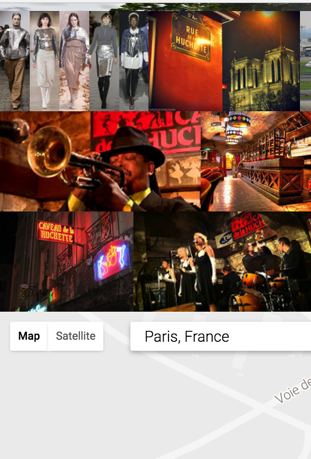
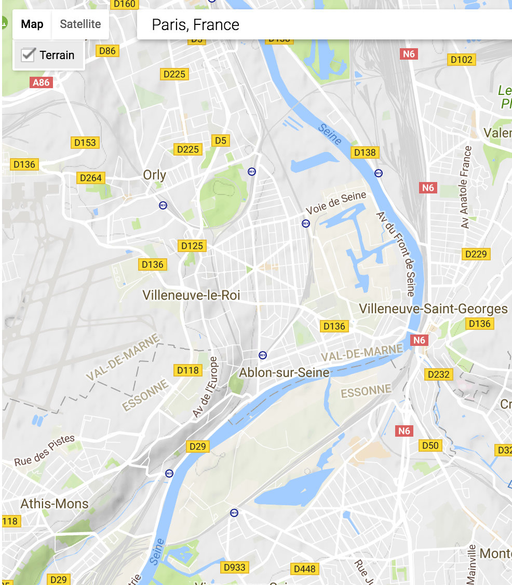
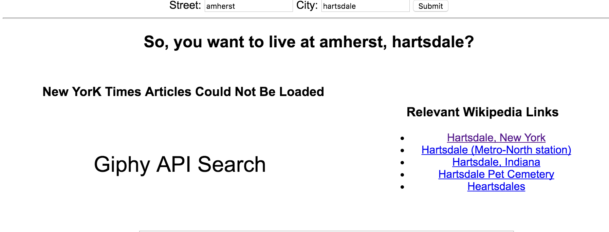

## Assignement two API's
DOMAINS / Paris / Destination

The first API uses fliker, which pulls images on the topic of Paris.

The Second API uses google maps. The user is able to state a location they are interested in.

The Third API uses NYTimes. IT allows the user to state the street and city. Once the usere presses select the user is able see a google pictue of that location and the bottom of the screen and presents a list of aticles on the topic of that location.

The last API uses wikipedia. The user is able to place in any topic they are interested in and returns a series of links realted to the topic. 

This project has been interesting. 
I constantly recieved errors but I did learn that my XML file error was due to security. I needed to place "jsonp" in my paramaters to stop recieving the message.(Daniell ShiffmanL youtube)

All api's are slightly different so you have to be clear about what content you want to show within an object. 

There are a few things I dont understand. When using the google API the palcement of the script was important sometimes it had to be the first in order to work. 

I used examples from codepen and youtube. 

